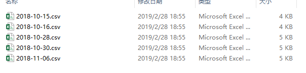
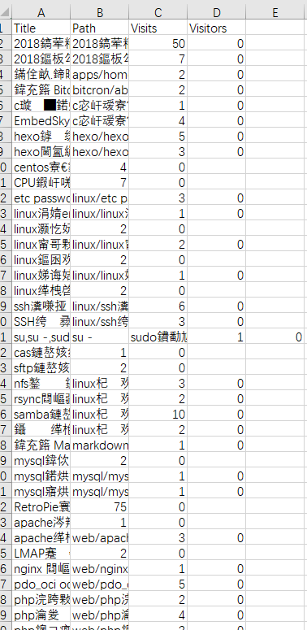
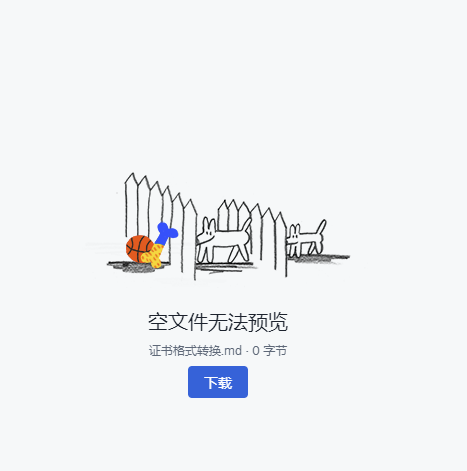

我的文章成功的被farbox or bitcron 这个付费博客托管商的程序bug弄没了
17.3月后至今的文章全没了，只剩下17.3月前的备份了，虽然就丢了几十篇的流水账，但是总归是让人不爽的，指不定哪天查问题要用到那消失在空气里的文章，重新去网上大海捞针 多不爽吖
牢记历史，警醒未来
事情经过
前几日闲的蛋疼想把blog的文章拉到本地做个备份，因为本地的文章之前被删了，
然而采用bitcron提供的MarkEditor将文章拉回本地时却只拉回了这种jb玩意儿

当时我心里就咯噔一下，得，我特么遇到bug了。这种手工作坊的产品出bug我是丝毫都不奇怪
好吧 那我就换个方式拉文件，用将文件同步到dropbox上
这次我又碰到了这个

是的，真刺激，所有文章都变成了空白文件 只有文件名了。

于是乎我本能的将dropbox的空白文章删除
嗯
删除操作同步到了我的博客 我的文章就此全部丢失
而后和博客托管商发邮件沟通，回复的都是一些然并卵的内容，我不知道是我描述问题的能力太差还是他理解能力太差，鸡同鸭讲

我：请问bitcron文件有备份嘛，求求你发给我文件备份（此处交代事情起因经过结果）
托管商：bitcron文件有备份的
我：求求你发给我文件备份
托管商：你可以从farbox同步到bitcron再同步到MarkEditor
我：求求你发给我文件备份
托管商：你可以同步到dropbox
我：我遇到bug了，求求你发给我文件备份
托管商：我这边显示没问题
我：。。。

我犯了几个致命的错误
1：信任付费博客托管商bitcron（永远不要相信他人不会出篓子）
2:  文章本地备份没做好（永远要留一手）
3：瞎jb操作（永远要想清楚再动手）

但是这个锅我是必须要丢博客托管商上的，是你们平台的BUG导致直接导致的我文章丢失，我文章没有备份好只是客观原因，好歹你这个博客我是付费购买的服务，还在你那里买了markeditor，还是抱着支持你的天真想法，我真是大错特错，吃一堑长一智，此后不会再犯同样的错误了。
bitcron，故事讲的很多，产品做的并不好，BYE~
hexo，阔别4年多我又回来了~
